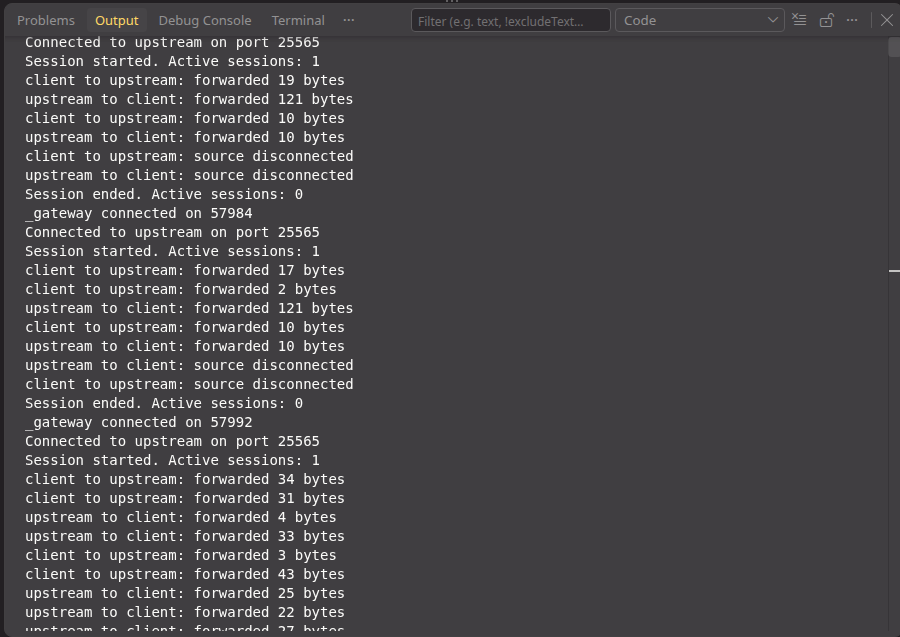
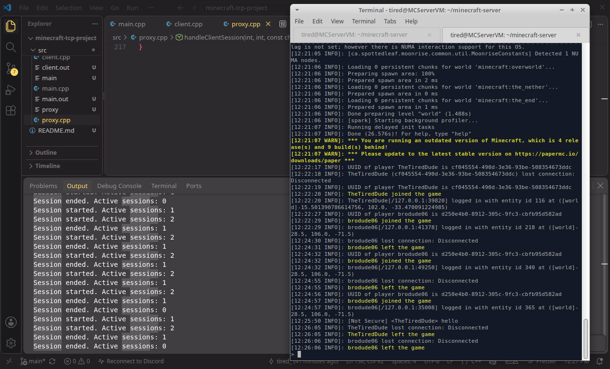

# Minecraft TCP Proxy in C++

A C++ TCP proxy that sits in front of a local Minecraft Java server. The proxy listens for Minecraft clients on port `25566`, opens a separate connection to `server.jar` on port `25565`, and relays the TCP byte stream unchanged in both directions. Both ports are configurable near the top of `src/proxy.cpp` through `listenerPort`, `upstreamPort`, and `upstreamIp`.

## Current progress

The core networking proxy is implemented and verified with real Minecraft traffic.

- Accepts Minecraft clients on `0.0.0.0:25566`
- Connects each session to `127.0.0.1:25565`
- Forwards traffic independently in both directions
- Uses `sendAll()` so partial `send()` calls do not drop bytes
- Shuts down each direction cleanly when its source disconnects
- Handles reconnecting and concurrent sessions
- Tracks and logs active relay sessions
- Works for online players when a Playit tunnel forwards to port `25566`

The next planned layer is Minecraft-protocol awareness: VarInt decoding and handshake inspection. The proxy will continue forwarding original bytes unchanged.

## What is Playit?

Playit is a third-party tunneling service that gives players a public address and forwards their connections through an outbound tunnel to a local machine behind a home network or NAT. In this project, Playit can forward its local target to the proxy instead of directly to `server.jar`.

## Architecture

```text
Minecraft client
    |
    | connects to localhost:25566
    v
C++ TCP proxy
    |
    | connects to 127.0.0.1:25565
    v
Minecraft Java server (server.jar)
```

With Playit configured to target the proxy instead of `server.jar` directly:

```text
Online player
    |
    v
Playit public address and tunnel
    |
    v
C++ TCP proxy :25566
    |
    v
Minecraft Java server :25565
```

The proxy plays two TCP roles:

- It acts as a server when it calls `accept()` for an incoming Minecraft client.
- It acts as a client when it calls `connect()` to the real Minecraft server.

Each session has two forwarding threads:

```text
clientSocket   -> upstreamSocket
upstreamSocket -> clientSocket
```

TCP is a byte stream, so one `recv()` result is not necessarily one complete Minecraft packet.

## Project structure

```text
.
├── README.md
├── docs/
│   └── Minecraft_TCP_Proxy_Project_Guide.md
└── src/
    ├── main.cpp       # Single-client TCP echo server exercise
    ├── client.cpp     # Interactive TCP echo client exercise
    └── proxy.cpp      # Multi-session Minecraft TCP proxy
```

For the broader roadmap and stretch goals, see [the project guide](docs/Minecraft_TCP_Proxy_Project_Guide.md).

## Requirements

- Linux
- `g++` with C++17 support
- Java compatible with the Minecraft server version
- A local Minecraft Java server
- A Minecraft Java client

## Build the binaries

From the project root:

```bash
cd /home/tired/minecraft-tcp-project

g++ -std=c++17 -Wall -Wextra -pedantic src/main.cpp -o /tmp/echo-server
g++ -std=c++17 -Wall -Wextra -pedantic src/client.cpp -o /tmp/echo-client
g++ -std=c++17 -Wall -Wextra -pedantic -pthread src/proxy.cpp -o /tmp/minecraft-proxy
```

`-pthread` is required for the proxy because it uses C++ threads.

## Run the proxy with VS Code Code Runner Extension

This project uses [Code Runner for VS Code](https://marketplace.visualstudio.com/items?itemName=formulahendry.code-runner) to run `src/proxy.cpp`.

Open `proxy.cpp` in VS Code, then click the **Run Code** button/icon at the top-right of the editor. Code Runner compiles and starts the currently open C++ file.

Configure Code Runner to run in the integrated terminal and compile threaded C++ programs with `-pthread`. Add this to VS Code `settings.json`:

```json
"code-runner.runInTerminal": true,
"code-runner.executorMap": {
  "cpp": "cd $dir && g++ -std=c++17 -Wall -Wextra -pedantic -pthread $fileName -o /tmp/$fileNameWithoutExt && /tmp/$fileNameWithoutExt"
}
```

Running in the terminal makes the proxy logs easier to read and keeps generated executables outside `src/`.

The extension supports the editor-title **Run Code** button you have been using. [Code Runner’s official Marketplace page](https://marketplace.visualstudio.com/items?itemName=formulahendry.code-runner) documents that workflow.

## Run the echo-server exercise

`main.cpp` listens on port `54000`.

Terminal 1:

```bash
cd /home/tired/minecraft-tcp-project
g++ -std=c++17 -Wall -Wextra -pedantic src/main.cpp -o /tmp/echo-server
/tmp/echo-server
```

`client.cpp` is an interactive client. To connect it directly to `main.cpp`, set its `port` variable to `54000`, then use Terminal 2:

```bash
cd /home/tired/minecraft-tcp-project
g++ -std=c++17 -Wall -Wextra -pedantic src/client.cpp -o /tmp/echo-client
/tmp/echo-client
```

Type messages at the `>` prompt. Type `exit` to close the connection.

> `client.cpp` currently uses port `54001` because it was also used for an earlier echo-proxy test.

## Set up a local Minecraft Java server

Download the server `.jar` from the official [Minecraft Java server download page](https://www.minecraft.net/en-us/download/server).

Create a separate server directory and place the downloaded file there as `server.jar`:

```bash
mkdir -p /path/to/minecraft-server
cd /path/to/minecraft-server
```

Run the server once:

```bash
java -jar server.jar nogui
```

The first run creates `eula.txt`. Change:

```text
eula=false
```

to:

```text
eula=true
```

Create `start.sh`:

```bash
#!/usr/bin/env bash
set -euo pipefail

# Adjust memory values for the host machine.
exec java -Xms1G -Xmx2G -jar server.jar nogui
```

Make it executable and run it:

```bash
chmod +x start.sh
./start.sh
```

The client and server versions must be compatible. See official [Minecraft multiplayer connection instructions](https://help.minecraft.net/hc/en-us/articles/32899741198989-Play-Minecraft-Java-Edition-Online-in-a-Multiplayer-Server).

## Run the Minecraft proxy

Terminal 1: start `server.jar`.

```bash
cd /path/to/minecraft-server
./start.sh
```

Terminal 2: build and start the proxy.

```bash
cd /home/tired/minecraft-tcp-project
g++ -std=c++17 -Wall -Wextra -pedantic -pthread src/proxy.cpp -o /tmp/minecraft-proxy
/tmp/minecraft-proxy
```

In Minecraft, add or connect to:

```text
localhost:25566
```

Join the world, move, chat, disconnect, and reconnect. The proxy should remain running and accept later sessions.

Expected output resembles:

```text
Connected to upstream on port 25565
Session started. Active sessions: 1
client to upstream: forwarded 45 bytes
upstream to client: forwarded 309 bytes
client to upstream: source disconnected
upstream to client: source disconnected
Session ended. Active sessions: 0
```

Byte counts vary because they are TCP read chunks, not guaranteed Minecraft packet boundaries.

## Allow online players through Playit

Keep `server.jar` listening on `25565` and the proxy on `25566`.

In Playit, set the tunnel’s local target to:

```text
127.0.0.1:25566
```

Online players use the public address supplied by Playit, not `localhost:25566`.

```text
Online player -> Playit tunnel -> proxy :25566 -> server.jar :25565
```

The proxy treats tunneled connections the same as local connections. Its session log can include Minecraft status pings as well as full gameplay sessions.

## Verification evidence

The proxy has been tested with real Minecraft traffic, repeated reconnects, and two active sessions at once.

```text
Session started. Active sessions: 2
client to upstream: forwarded ... bytes
upstream to client: forwarded ... bytes
Session ended. Active sessions: 0
```

## Screenshots

Save screenshots under `docs/screenshots/`, then add them here:

```markdown



```

Suggested captions:

- Minecraft traffic relayed in both directions through `localhost:25566`.
- Two active proxy sessions followed by clean disconnects.

## Scope and next steps

The proxy is a local TCP intermediary; it does not replace Playit’s public relay/tunnel service.

Planned local-proxy work:

1. Decode Minecraft VarInts.
2. Inspect and log the initial handshake without modifying it.
3. Add status/ping metrics and connection-duration summaries.
4. Add command-line configuration, graceful shutdown, tests, CMake, and structured logs.

Replacing the public tunnel layer with a self-hosted relay and outbound local tunnel is an optional stretch goal described in the project guide.